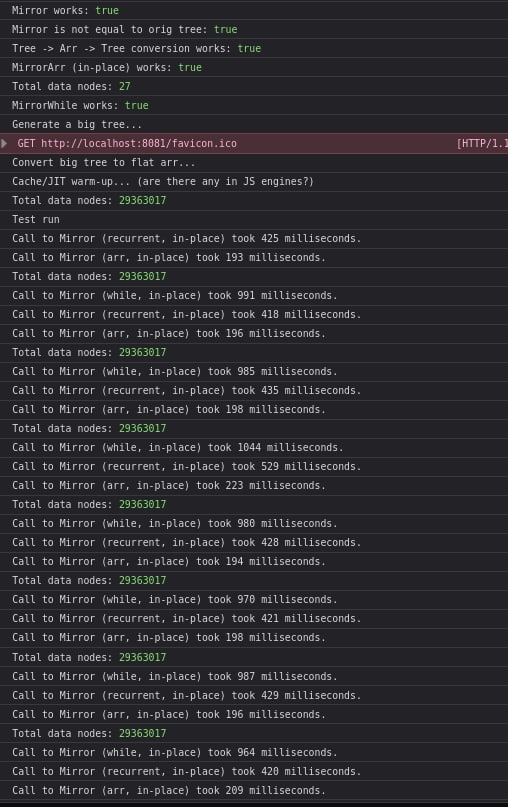

# Mirror binary tree in JavaScript (TypeScript)

Implement two classical algorithms (recurrent and basic cycle), and one custom, based on array data structure for tree storage. It turned out to be 2x faster, compared to classical solutions. 



# How to use

```
yarn install
yarn start
# Open your browser to the url noted in output (usually localhost:8008)
```
and check the develper console for benchmark results.
